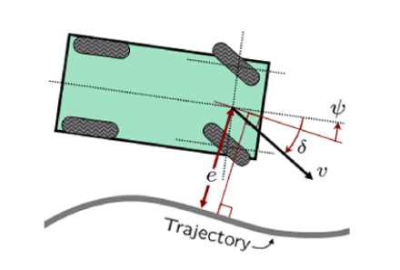

# 4. Stanley Controller

In this chapter, the Stanley steering controller class is implemented for path tracking. This class implements the Stanley path tracking algorithm, which computes a steering angle to guide a vehicle's front axle back onto a reference course by correcting both heading error and lateral (cross-track) error.

Before getting into the code, let's get some basic understanding behind the algorithm:
### **Stanley Controller**

- This algorithm is also known sometimes as `Hoffmann-Stanley-control`.
- Developed at Stanford for autonomous vehicles DARPA challenge
- Combines heading error and cross-track error.

1. **Heading error** ($\large{\psi_e}$)— the difference between the vehicle's heading and the path's tangent

2. **Cross-track error** ($\large{e}$) — lateral distance from the front axle to the nearest path point



$$
\delta = \psi_e + \arctan\!\left(\frac{k \cdot e}{v}\right)
$$

Image credit: https://ai.stanford.edu/~gabeh/papers/hoffmann_stanley_control07.pdf
Ref: https://www.ri.cmu.edu/pub_files/2009/2/Automatic_Steering_Methods_for_Autonomous_Automobile_Path_Tracking.pdf


**Advantages over Pure Pursuit**:

- Directly minimizes cross-track error at the front axle.
- Better performance at higher speeds.
- Naturally speed-adaptive.
- Pure Pursuit is great for robots, low-speed vehicles, and when simplicity matters.
- Stanley is preferred for autonomous cars and situations where you need tighter path adherence at varying speeds.

**Disadvantages**:
- needs tuning of parameter $k$.
- can be unstable at low speed(divison be 0) and steady state error.


## 4.1 StanleyController Class

The controller class is located at:  
[stanley_controller.py](/src/components/control/stanley/stanley_controller.py)

```python
"""
stanley_controller.py

Author: Shisato Yano
"""

import sys
from pathlib import Path
from math import sin, cos, tan, atan2

abs_dir_path = str(Path(__file__).absolute().parent)
relative_path = "/../../../components/"

sys.path.append(abs_dir_path + relative_path + "state")

from state import State


class StanleyController:
    """
    Controller class by Stanley steering control algorithm
    """
```

This class imports `sin`, `cos`, `tan`, and `atan2` from Python's `math` module, as these trigonometric functions are used throughout the steering calculations. It also imports the `State` class to construct a virtual front axle state from the vehicle's rear axle state.

---

### 4.1.1 Constructor

```python
def __init__(self, spec, course=None):
    self.SPEED_PROPORTIONAL_GAIN = 1.0
    self.CONTROL_GAIN = 0.5
    self.WHEEL_BASE_M = spec.wheel_base_m

    self.course = course
    self.target_course_index = 0
    self.target_accel_mps2 = 0.0
    self.target_speed_mps = 0.0
    self.target_yaw_rate_rps = 0.0
    self.target_steer_rad = 0.0
```

The constructor takes a `VehicleSpecification` object and an optional `CubicSplineCourse` object. The key member variables are:

| Variable | Value | Description |
|---|---|---|
| `SPEED_PROPORTIONAL_GAIN` | 1.0 | Gain for proportional speed control |
| `CONTROL_GAIN` | 0.5 | Stanley gain `k` for cross-track error correction |
| `WHEEL_BASE_M` | from spec | Distance between front and rear axles [m] |
| `target_course_index` | 0 | Index of the nearest point on course |
| `target_accel_mps2` | 0.0 | Computed acceleration command [m/s²] |
| `target_steer_rad` | 0.0 | Computed steering angle command [rad] |
| `target_yaw_rate_rps` | 0.0 | Computed yaw rate command [rad/s] |

---

## 4.2 Private Methods

### 4.2.1 `_calculate_front_axle_state`

```python
def _calculate_front_axle_state(self, state):
    curr_rear_x = state.get_x_m()
    curr_rear_y = state.get_y_m()
    curr_yaw = state.get_yaw_rad()
    curr_spd = state.get_speed_mps()

    curr_front_x = curr_rear_x + self.WHEEL_BASE_M * cos(curr_yaw)
    curr_front_y = curr_rear_y + self.WHEEL_BASE_M * sin(curr_yaw)
    curr_front_state = State(curr_front_x, curr_front_y, curr_yaw, curr_spd)

    return curr_front_state
```

The Stanley algorithm is applied at the **front axle**, not the rear axle. This method projects the rear axle position forward by `WHEEL_BASE_M` along the vehicle's current heading to compute where the front axle is, and returns it as a new `State` object.

The front axle position is calculated as:

```
front_x = rear_x + L * cos(yaw)
front_y = rear_y + L * sin(yaw)
```

where `L` is the wheelbase.

---

### 4.2.3 `_calculate_target_course_index`

```python
def _calculate_target_course_index(self, state):
    nearest_index = self.course.search_nearest_point_index(state)
    self.target_course_index = nearest_index
```

This method finds the index of the nearest point on the course to the front axle's current position. This index is used in subsequent steps to look up the target speed and compute tracking errors.

---

### 4.2.4 `_decide_target_speed_mps`

```python
def _decide_target_speed_mps(self):
    self.target_speed_mps = self.course.point_speed_mps(self.target_course_index)
```

The target speed is read directly from the course at the nearest point index. This allows the course to specify variable speed profiles along its length.

---

### 4.2.4 `_calculate_target_acceleration_mps2`

```python
def _calculate_target_acceleration_mps2(self, state):
    diff_speed_mps = self.target_speed_mps - state.get_speed_mps()
    self.target_accel_mps2 = self.SPEED_PROPORTIONAL_GAIN * diff_speed_mps
```

A simple proportional speed controller is used. The acceleration command is proportional to the difference between the target speed and the current front axle speed:

```
accel = Kp * (target_speed - current_speed)
```

---

### 4.2.5 `_calculate_tracking_error`

```python
def _calculate_tracking_error(self, state):
    error_lon_m, error_lat_m, error_yaw_rad = self.course.calculate_lonlat_error(state, self.target_course_index)
    return error_lon_m, error_lat_m, error_yaw_rad
```

This method delegates to the course object to compute three error terms between the front axle and the nearest course point:

| Error | Description |
|---|---|
| `error_lon_m` | Longitudinal error along the course tangent [m] |
| `error_lat_m` | Lateral (cross-track) error perpendicular to the course [m] |
| `error_yaw_rad` | Heading error between vehicle and course tangent [rad] |

Only `error_lat_m` and `error_yaw_rad` are used for steering.

---

### 4.2.6 `_calculate_control_input`

```python
def _calculate_control_input(self, state, error_lat_m, error_yaw_rad):
    curr_spd = state.get_speed_mps()
    if abs(curr_spd) != 0.0:
        error_steer_rad = atan2(self.CONTROL_GAIN * error_lat_m, curr_spd)
    else:
        error_steer_rad = 0.0
    self.target_steer_rad = -1 * (error_steer_rad + error_yaw_rad)

    self.target_yaw_rate_rps = curr_spd * tan(self.target_steer_rad) / self.WHEEL_BASE_M
```

This is the core of the Stanley algorithm. The steering angle is computed as:

```
δ = -(ψ_error + arctan(k * e_lat / v))
```
- minus sign comes due to the sign convention of steering angle.

where:
- `ψ_error` (`error_yaw_rad`) - heading error between vehicle and course tangent
- `e_lat` (`error_lat_m`) - lateral cross-track error
- `k` (`CONTROL_GAIN`) - Stanley gain constant
- `v` (`curr_spd`) - current vehicle speed

The `atan2` term increases steering correction as lateral error grows, and decreases it at higher speeds to prevent overcorrection. A guard against zero speed is included to avoid division by zero.

The yaw rate is then derived from the steering angle using the kinematic bicycle model:

```
yaw_rate = v * tan(δ) / L
```
since, for kinematic bicycle model: 
```
tan(δ) = L / R => R = L / tan(δ)
```

---

## 4.3 Public Methods

### 4.3.1 `update`

```python
def update(self, state, time_s):
    if not self.course: return

    front_axle_state = self._calculate_front_axle_state(state)
    self._calculate_target_course_index(front_axle_state)
    self._decide_target_speed_mps()
    self._calculate_target_acceleration_mps2(front_axle_state)
    _, error_lat_m, error_yaw_rad = self._calculate_tracking_error(front_axle_state)
    self._calculate_control_input(front_axle_state, error_lat_m, error_yaw_rad)
```

This is the main entry point called every simulation frame by `FourWheelsVehicle`. It orchestrates all private methods in order:

```
update()
1. Project rear axle - front axle state
2. Find nearest course index from front axle
4. Read target speed at that index
4. Compute acceleration from speed error
5. Compute lateral and heading errors
6. Compute steering angle and yaw rate (Stanley law)
```

If no course is set, the method returns early without computing anything.

---

### 4.3.2 Getter Methods

```python
def get_target_accel_mps2(self):
    return self.target_accel_mps2

def get_target_yaw_rate_rps(self):
    return self.target_yaw_rate_rps

def get_target_steer_rad(self):
    return self.target_steer_rad
```

These three getter methods expose the computed control outputs. They are called by `FourWheelsVehicle` after each `update()` to apply the commands to the vehicle's state.

---

### 4.3.3 `draw`

```python
def draw(self, axes, elems):
    pass
```

This method is required by the visualizer interface - all objects registered with `GlobalXYVisualizer` must have a `draw` method. For the controller, no visual element needs to be drawn, so the body is left empty with `pass`.

**Author**: Mohit Kumar

